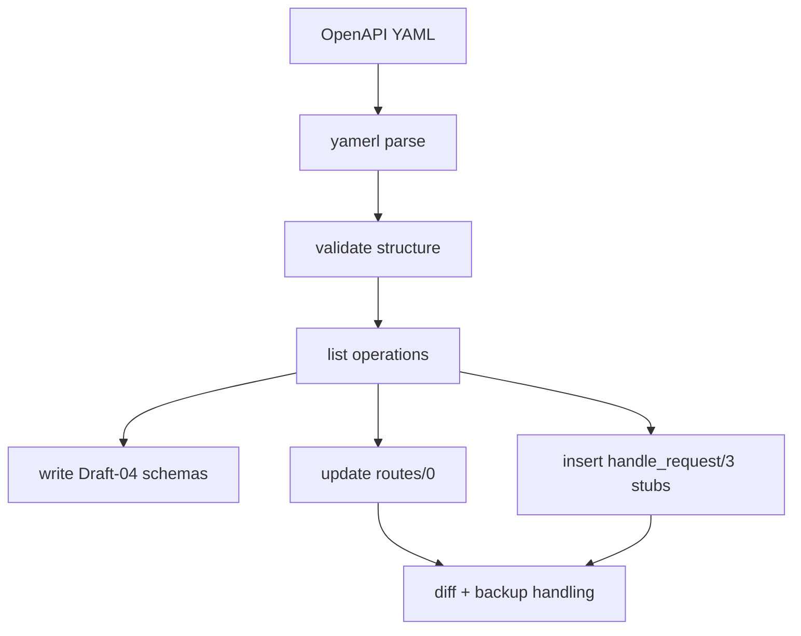
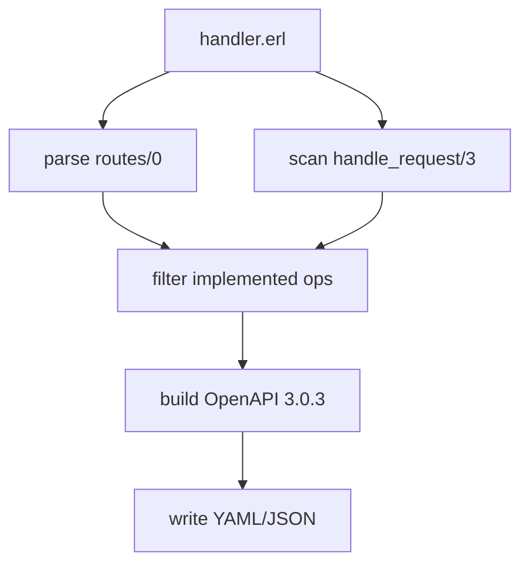

# Architecture

## Overview
- Provider: `rebar3_openapi_prv`
- YAML loader/validator: `openapi_yaml_loader`, `openapi_validator`
- Schema handling: `schema_draft04_converter`, `schema_writer`
- Handler parsing/updating: `handler_parser`, `handler_routes_updater`, `handler_clauses_updater`
- Spec generation: `spec_generator`
- Utilities: `diff_preview`, `backup_manager`, `logging`

## Flow: OpenAPI → Erlang

## Flow: Erlang → OpenAPI

## Notes
- YAML only for input (3.0.x prioritized; 3.1 best-effort)
- No operationId normalization; exact usage as in handlers
- Dry-run prints unified diff; backups optional
